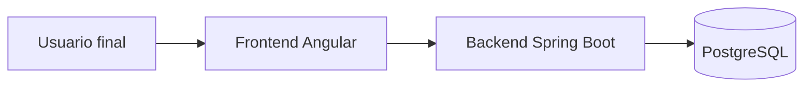

# WorkTrace

**WorkTrace** es un proyecto SaaS orientado a la gestión laboral, el control de presencia y la trazabilidad operativa en entornos empresariales. Su objetivo es centralizar procesos como fichajes, incidencias, horarios, centros de trabajo, perfiles de usuario y auditorías, ofreciendo una plataforma clara para trabajadores, administradores e inspectores.

El valor añadido del sistema reside en combinar una experiencia web accesible con una API robusta, segura y preparada para operar sobre datos laborales sensibles. WorkTrace busca facilitar el seguimiento de la actividad laboral, mejorar la transparencia de los registros y proporcionar una base técnica sólida para la explotación futura de información operativa.

## Arquitectura General del Sistema

WorkTrace sigue un modelo **cliente-servidor** dividido en dos aplicaciones principales:

### Backend - Spring Boot

El backend actúa como núcleo del sistema. Expone una **API REST** responsable de la lógica de negocio, autenticación, autorización, persistencia y generación de información operativa. Centraliza el acceso a datos y define los contratos consumidos por el cliente web.

Responsabilidades principales:

- Gestión de usuarios, empresas, roles y perfiles.
- Control de fichajes, incidencias, horarios y centros de trabajo.
- Seguridad basada en autenticación JWT y control de acceso por roles.
- Persistencia de datos en PostgreSQL mediante JPA.
- Exposición de documentación técnica de API mediante OpenAPI/Swagger.

### Frontend - Angular

El frontend es la capa de presentación de WorkTrace. Proporciona una **SPA web** orientada a los distintos perfiles de usuario y consume la API REST del backend para mostrar datos, ejecutar operaciones y mantener una experiencia interactiva.

Responsabilidades principales:

- Interfaz de usuario para trabajadores, administradores e inspectores.
- Gestión de navegación, formularios, validaciones y estados de vista.
- Consumo tipado de la API REST mediante servicios Angular.
- Separación entre componentes funcionales, compartidos y transversales.
- Presentación clara de paneles, fichajes, incidencias y datos operativos.

## Mapa del Monorepo

| Ruta | Descripción | Documentación |
| --- | --- | --- |
| 📁 `/worktrace-backend` | API REST desarrollada en Java con Spring Boot. | [Ver documentación específica](./worktrace-backend/README.md) |
| 📁 `/worktrace-frontend` | Cliente web SPA desarrollado con Angular y TypeScript. | [Ver documentación específica](./worktrace-frontend/README.md) |
| 📁 `/database` | Scripts SQL de esquema y datos iniciales para la base de datos. | Soporte de infraestructura de datos |
| 📄 `/docker-compose.yml` | Orquestación local de PostgreSQL/PostGIS para el entorno de desarrollo. | Configuración de infraestructura |

## Pila Tecnológica Global

### Visión por capas

| Capa | Tecnología | Rol en el sistema |
| --- | --- | --- |
| Cliente web | Angular, TypeScript | Interfaz de usuario y experiencia de navegación |
| API de negocio | Spring Boot, Java | Lógica de dominio, seguridad y exposición REST |
| Persistencia | PostgreSQL | Almacenamiento relacional de datos laborales y operativos |
| Build y automatización | Gradle, npm | Compilación, dependencias y ciclo de desarrollo |
| Infraestructura local | Docker Compose | Aprovisionamiento del servicio de base de datos |

## Autor e Información Académica

| Campo | Información |
| --- | --- |
| Autor | David García Torres |
| Titulación | Grado Superior en Desarrollo de Aplicaciones Web (DAW) |
| Centro educativo | IES Isidra de Guzmán |
| Proyecto | Trabajo de Fin de Grado |
| Título | WorkTrace |
| Objetivo académico | Diseñar y desarrollar una solución SaaS para la gestión laboral, el control de presencia y la auditoría de registros operativos en un entorno empresarial. |

## Documentación Específica

Este README ofrece una visión global del repositorio. La documentación detallada de instalación, configuración, ejecución y arquitectura interna se mantiene en cada módulo:

- [Backend WorkTrace](./worktrace-backend/README.md)
- [Frontend WorkTrace](./worktrace-frontend/README.md)
