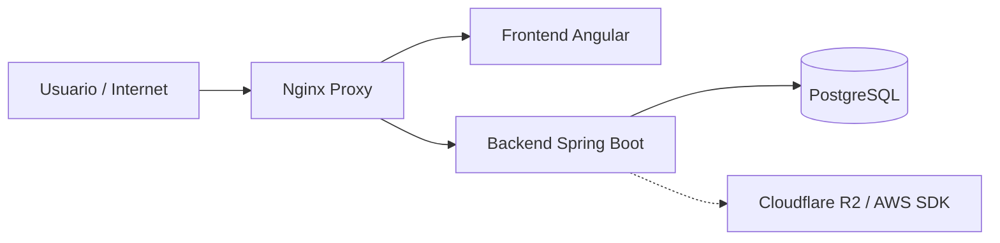

# WorkTrace

**WorkTrace** es una plataforma web concebida bajo un modelo de ***Software as a Service*** (**SaaS**) con arquitectura multi-inquilino (***Multi-Tenant***). Su propósito principal es gestionar el registro horario y el fichaje geolocalizado, orientándose de forma específica a empresas del sector servicios para garantizar el pleno cumplimiento de la legislación laboral vigente.

El valor añadido del sistema reside en ir más allá del simple registro: WorkTrace asegura la inalterabilidad de los datos mediante auditorías inmutables y previene el fraude cruzando coordenadas GPS con telemetría de red e IPs. Todo ello operando sobre una infraestructura segura y contenerizada que proporciona una base técnica sólida para la explotación forense por parte de la Inspección de Trabajo.

## Arquitectura General del Sistema

WorkTrace sigue un modelo **cliente-servidor** desacoplado, orquestado mediante contenedores y protegido perimetralmente por un ***proxy*** inverso:

### Backend - Spring Boot

El ***backend*** actúa como núcleo del sistema, desarrollado en **Java 21**. Expone una **API REST** responsable de la lógica de negocio, aplicando reglas estrictas de cumplimiento normativo y aislamiento de datos.

Responsabilidades principales:

* **Gestión Multi-inquilino:** Aislamiento lógico de los datos de cada empresa cliente en una infraestructura compartida.
* **Precisión Temporal Absoluta:** Uso de `OffsetDateTime` para registrar el instante exacto respecto al estándar UTC, evitando discrepancias por zonas horarias.
* **Motor de Auditoría Inmutable:** Registro forense de modificaciones mediante formato `JSONB`, almacenando la carga útil previa y posterior junto al autor del cambio.
* **Sellado de Jornada:** Generación de cierres diarios mediante una cadena de funciones *hash* criptográficas para evitar la inyección de registros en fechas pasadas.
* **Almacenamiento S3:** Integración con **Cloudflare R2** mediante el oficial **AWS SDK** para el manejo de activos estáticos pesados.

### Frontend - Angular

El ***frontend*** es una ***Single Page Application*** (**SPA**) modular y reactiva desarrollada con **Angular 21** y **TypeScript 5.9**.

Responsabilidades principales:

* **Perfiles de Acceso Diferenciados:** Interfaces dedicadas para Empleados, Administradores y un perfil de "solo lectura" para Auditores/Inspectores de Trabajo.
* **Fichaje Geolocalizado:** Captura pasiva de coordenadas y representación espacial (Geofencing) mediante la integración de **Leaflet**.
* **Estado Reactivo:** Manejo de flujos de datos asíncronos apoyándose en la librería **RxJS**.
* **UI Estándar y Accesible:** Implementación estricta de directrices **Material Design** a través de componentes modulares.

## Mapa del Monorepo

| Ruta | Descripción | Documentación |
| --- | --- | --- |
| 📁 `/worktrace-backend` | **API REST** desarrollada en Java con Spring Boot. | [Ver documentación específica](./worktrace-backend/README.md) |
| 📁 `/worktrace-frontend` | Cliente web **SPA** desarrollado con Angular y TypeScript. | [Ver documentación específica](./worktrace-frontend/README.md) |
| 📁 `/database` | Scripts SQL de esquema y datos iniciales para la base de datos. | Soporte de infraestructura de datos |
| 📄 `/docker-compose.yml` | Orquestación en producción/desarrollo (Nginx, Spring Boot, PostgreSQL). | Configuración de infraestructura |

## Pila Tecnológica Global

### Visión por capas

| Capa | Tecnología | Rol en el sistema |
| --- | --- | --- |
| Cliente web | Angular, TypeScript, Leaflet | Interfaz de usuario, representación espacial y UX. |
| API de negocio | Spring Boot, Java, JUnit 5 | Lógica de dominio, seguridad transaccional y exposición REST. |
| Persistencia | PostgreSQL | Almacenamiento relacional e inmutable (*JSONB*) de auditoría. |
| Storage S3 | Cloudflare R2 | Almacenamiento desacoplado de recursos estáticos. |
| Orquestación | Docker Compose, Nginx | Aislamiento de servicios y proxy inverso perimetral. |

## Autor e Información Académica

| Campo | Información |
| --- | --- |
| Autor | David García Torres |
| Titulación | Grado Superior en Desarrollo de Aplicaciones Web (DAW) |
| Centro educativo | IES Isidra de Guzmán |
| Proyecto | Trabajo de Fin de Grado |
| Título | WorkTrace |
| Objetivo académico | Diseñar y desarrollar una solución SaaS para la gestión laboral, el control de presencia y la auditoría de registros operativos en un entorno empresarial. |

## Documentación Específica

Este `README` ofrece una visión global de la arquitectura del repositorio. La documentación detallada de instalación, configuración, ejecución y variables de entorno se mantiene en cada módulo:

* [Backend WorkTrace](https://www.google.com/search?q=./worktrace-backend/README.md)
* [Frontend WorkTrace](https://www.google.com/search?q=./worktrace-frontend/README.md)
